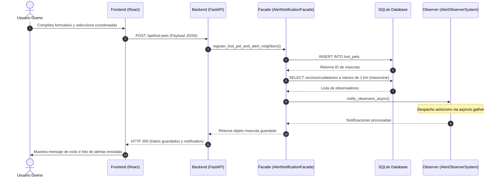
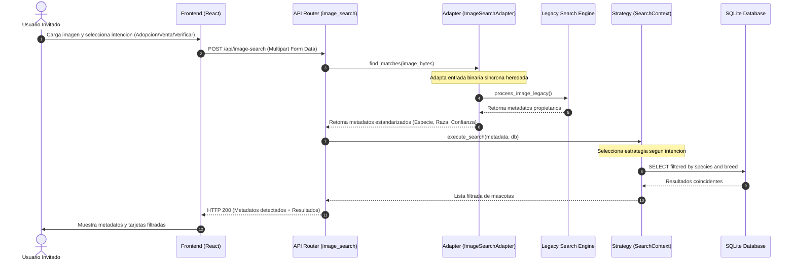
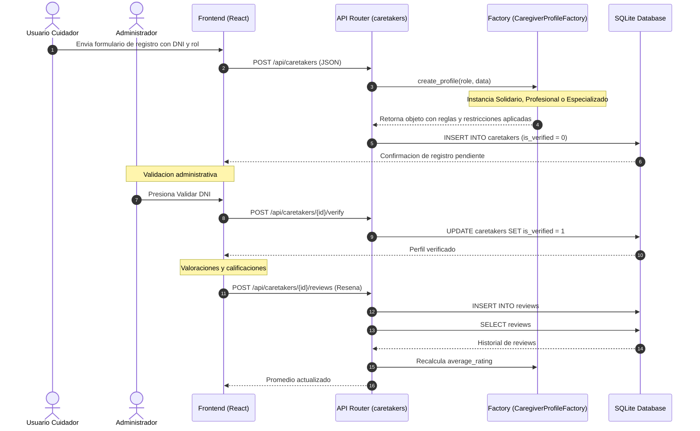

# Plataforma PetMatch & Alert - PC4

Este proyecto implementa un sistema de software modular desarrollado en FastAPI (Python) y React (Vite) con persistencia de datos local en SQLite. La aplicacion gestiona el reporte de mascotas perdidas, la emision de alertas geograficas asincronas en un radio maximo de 1 km, la busqueda automatizada de mascotas basada en analisis de imagenes estructurada por intenciones de usuario y la administracion de una red de cuidadores temporales clasificados por roles operativos.

La arquitectura del sistema se rige bajo la implementacion de 6 Patrones de Diseno de la metodologia Gang of Four (GoF) para garantizar la modularidad, escalabilidad e intercambiabilidad de los componentes del dominio.

---

## Patrones de Diseno Implementados

### 1. Patrones Creacionales

*   **Singleton (SQLiteManager)**:
    *   *Ubicacion:* backend/app/config/db.py
    *   *Proposito:* Encapsula y controla una unica instancia de conexion de base de datos SQLite activa a lo largo del ciclo de vida del servidor web, optimizando la asignacion de recursos y controlando el estado transaccional.
*   **Factory Method (CaregiverProfileFactory)**:
    *   *Ubicacion:* backend/app/patterns/creational/factory.py
    *   *Proposito:* Instancia dinamicamente el tipo de perfil de cuidador correspondiente (Cuidador Solidario, Cuidador Profesional o Cuidador Especializado) evaluando las restricciones de operacion, limites de mascotas permitidas y reglas de negocio aplicables a cada rol.

### 2. Patrones Estructurales

*   **Adapter (ImageSearchAdapter)**:
    *   *Ubicacion:* backend/app/patterns/structural/adapter.py
    *   *Proposito:* Adapta las interfaces y flujos sincronos de un componente de clasificacion heredado (ExternalLegacyPetSearchEngine) para integrarlo de forma asincrona y estructurada mediante modelos estandarizados JSON en el enrutador de FastAPI.
*   **Facade (AlertNotificationFacade)**:
    *   *Ubicacion:* backend/app/patterns/structural/facade.py
    *   *Proposito:* Simplifica el flujo complejo de alertas geograficas al unificar las tareas de persistencia del reporte, calculo de coordenadas radiales Haversine y disparo de notificaciones a los observadores en una unica llamada limpia de API.

### 3. Patrones de Comportamiento

*   **Observer (AlertObserverSystem)**:
    *   *Ubicacion:* backend/app/patterns/behavioral/observer.py
    *   *Proposito:* Registra y despacha notificaciones push/email concurrentes a vecinos y cuidadores activos (observadores) en un rango de 1 km en paralelo mediante hilos asincronos concurrentes (asyncio.gather).
*   **Strategy (SearchIntentStrategy)**:
    *   *Ubicacion:* backend/app/patterns/behavioral/strategy.py
    *   *Proposito:* Encapsula y selecciona dinamicamente el algoritmo de busqueda de mascotas segun la intencion del usuario (adopcion en ONGs, venta en criaderos o localizacion de alertas activas).

---

## Flujos de Control del Sistema

### Flujo 1: Registro de Mascota Perdida y Alerta Geografica (Facade + Observer)

### Flujo 2: Buscador Inteligente por Imagen (Adapter + Strategy)

### Flujo 3: Red de Cuidadores, Validacion y Calificaciones (Factory Method)

---

## Estructura General del Proyecto

PC4_DesarrolloDeSoftware/
├── backend/
│   ├── app/
│   │   ├── main.py                # Entrada FastAPI e inicializacion de semilla automatica
│   │   ├── config/
│   │   │   └── db.py              # Singleton de base de datos SQLite
│   │   ├── models/
│   │   │   └── schemas.py         # Modelos de validacion de datos (Pydantic)
│   │   ├── routers/               # Rutas de la API (Lost Pets, Caretakers, Image Search)
│   │   └── patterns/
│   │       ├── creational/        # Factory Method
│   │       ├── structural/        # Adapter y Facade
│   │       └── behavioral/        # Observer y Strategy
│   ├── requirements.txt
│   └── run.py
├── frontend/
│   ├── src/
│   │   ├── App.jsx                # Interfaz de usuario interactiva en React
│   │   ├── index.css              # Hojas de estilo y configuraciones de diseno
│   │   └── main.jsx
│   ├── package.json
│   └── vite.config.js
├── REQUERIMIENTOS.md              # Especificacion de requerimientos tecnicos
├── EJECUCION.md                   # Guia detallada de despliegue y validacion
└── README.md                      # Descripcion del proyecto y patrones de diseno
